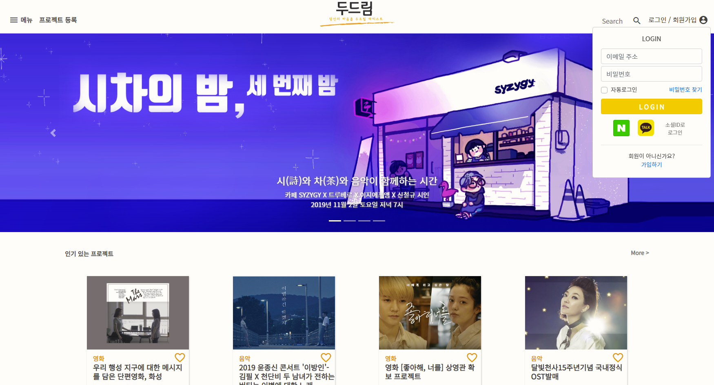
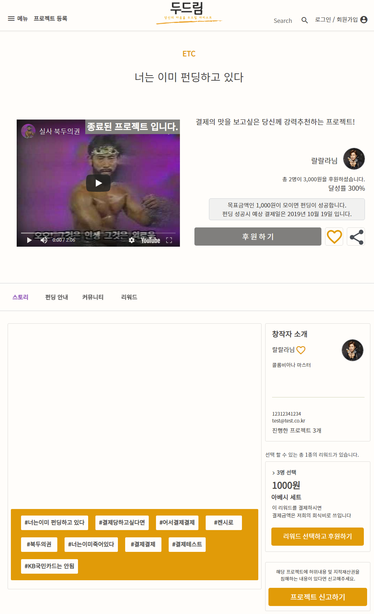
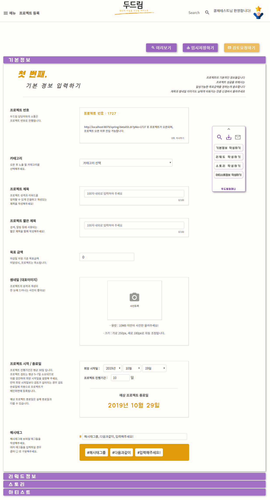
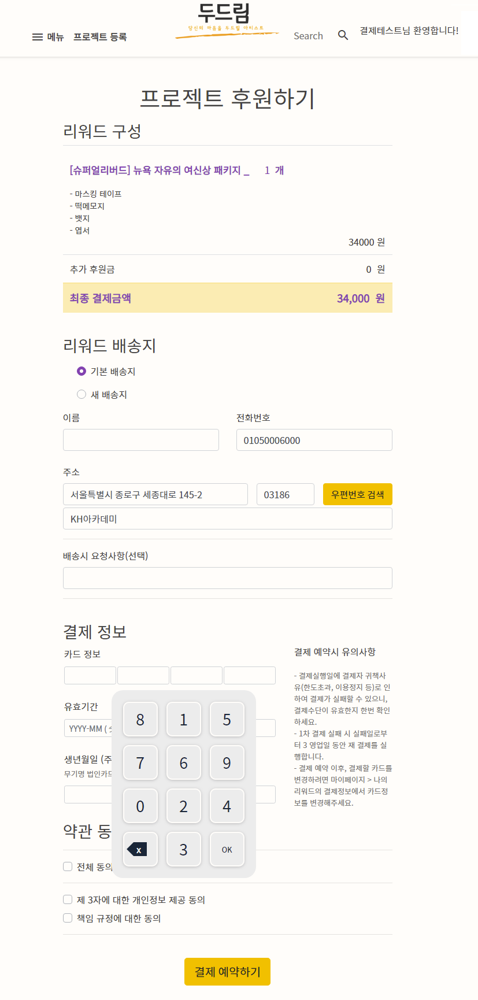

# dodoream Project
> 당신의 마음을 두드릴 아티스트를 후원하세요/모두들 두드릴 당신의 꿈을 보여주세요 -- '두드림'

'아티스트를 위한 크라우드 펀딩 사이트'를 주제로 기획/제작된 웹 페이지 입니다.
KH정보교육원 - 디지털컨버전스 융합SW개발자 양성과정 5회차 '촉촉한 초코칩조'의 파이널 프로젝트로 기획되었으며,
[박성혁](https://github.com/park-sh1), [송창혁](https://github.com/crckrjck), [양주연](https://github.com/wndus12), [이영상](https://github.com/0-sanglee), [제상란](https://github.com/jesangran), [황선희](https://github.com/raonnzena12) 총 6명이 참가하였습니다.

## 개발환경

- OS : Windows 7/10
- FW : Spring Framework / Bootstrap
- Front-end : javascript / jQuery / AJAX / JSON / HTML5 / CSS3
- Back-end : java8 / node.js / MyBatis
- WAS : Apache Tomcat
- DB : Oracle
- Developer Tools : STS / Eclipes / VS Code / SqlDeveloper
- 사용 API : kakao API / NAVER(네아로)API / Import API / Twitter API / SummerNote API / Google SMTP

## 프로젝트 화면

- 로그인/로그아웃/쿠키를 이용한 자동 로그인 구현
- 네아로 로그인/카카오로그인 구현
- 회원가입 구현
- 인기순/최신순/달성임박순으로 프로젝트 리스트 로딩

- 해시태그 구현
- 상태값에 따른 펀딩상태 구분
- 리워드 선택 및 수량변경/ 펀딩 가격 자동계산 구현
- 커뮤니티 댓글 및 대댓글 기능 구현
- 프로젝트 좋아요 / 아티스트 팔로우 기능 구현

- 유저 친화적인 프로젝트 등록 페이지 구현
- 등록 사이드 리모컨 구현
- 각 input 폼 정규식 구현
- 이미지 업로드 및 동영상 주소 업로드 구현
- 미리보기 / 임시저장 구현 
- 페이지에서 벗어날 시 주의알림 출력 구현

- 예약 내역 확인 구현
- 총 펀딩금액 계산 구현
- 주소검색 API 구현
- 카드번호 입력 클릭 키보드 구현
- importAPI로 카드 결제창 없는 정기결제 구현
- node.js 서버로 billingKey 발급 및 폐기 구현
- 카카오 / 트위터 / 페이스북 공유하기 구현

## 업데이트 내역

* 0.1.0
    * 프로젝트 완성
* 0.0.1
    * 작업 진행 중

